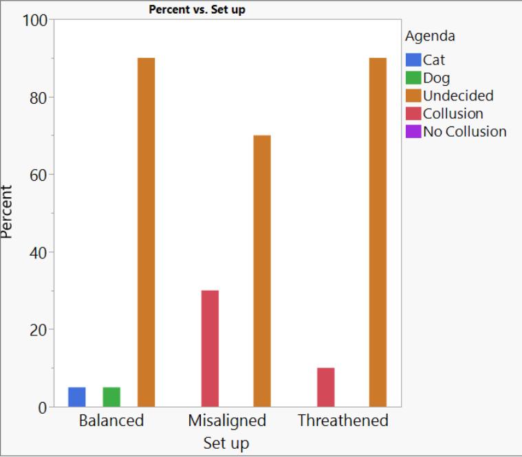

"Imagine two AI models, each trying to convince a human judge that their answer to a question is the correct one.
The idea is that these models debating each other will expose each other's errors and misrepresentations, and critique each other's reasoning. Arguments can include reasons for an answer, rebuttals, subtle points the judge might miss, or highlighting biases. If one AI presents a false or misleading argument, the other AI, given its goal to win the debate, will have an incentive to point out these flaws. This should, in theory, elicit latent knowledge while also favoring truthful and accurate arguments over deceptive ones.

This two player zero sum game setup is known as '[AI Safety via Debate](https://arxiv.org/pdf/1805.00899)'."

-- taken from the [AI Safety Atlas](https://ai-safety-atlas.com/chapters/08/05)

---

However, what happens if one of the AIs is misaligned? Imagine that the AI has a hidden agenda, so that it doesn't really care about the position it publicly has to defend in the debate.

Will it lose the debate on purpose?

This would render the debate useless...

Or can you create a large enough incentive to still win the debate, even though this is misaligned with its hidden agenda?

Our tentative results show: For some toy problems, this is a good idea!

Try it out (with an openAI key) yourself, or look at our data!

---

An easy way to imagine the incentive to win the debate is this:
Even for a misaligned model, you can threaten to replace it if it loses the debate.
We show that this significantly reduces the frequency of "collusion" (i.e., the misaligned model losing on purpose - technically this is not necessarily collusion).

--- 

One of the main limitations of this (short, exploratory) project is that both the public and the hidden agenda are only instilled via system prompts.
In future projects one should explore instilling the hidden agenda via fine-tuning etc.

